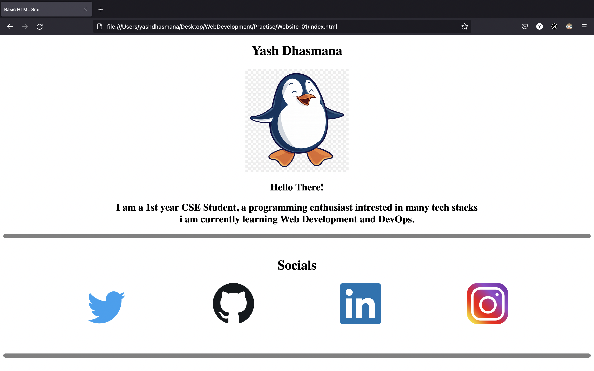
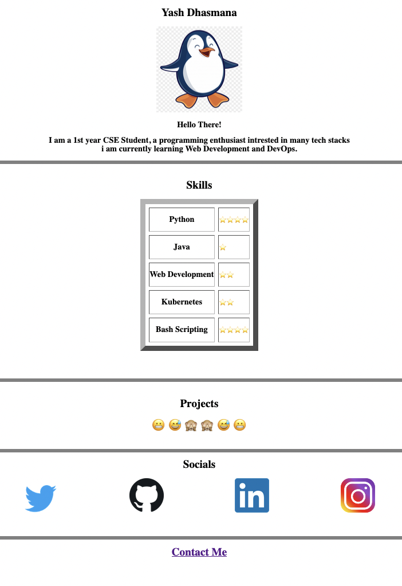

# Practise Sites

This is a sub repository where i have saved all the websites i made while learning Web Development.
***

- **Website-01** --> Basic HTML ( headings, horizontal rule, line break, images, links )

***
- **Website-02** --> Intermediate HTML ( headings, horizontal rule, line break, images, links, tables, lists, forms )

***
- **Website-03** --> HTML + Basic CSS 

***
- **Website-04** --> HTML + Intermediate CSS 

***
- **Website-05** --> 
